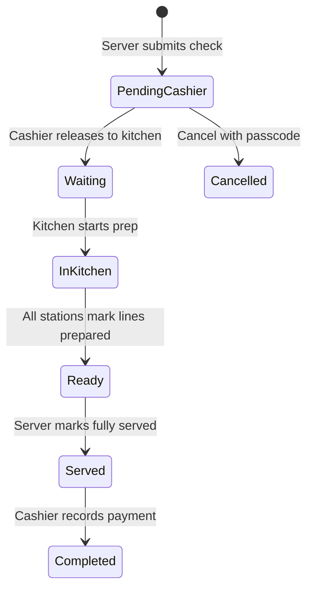
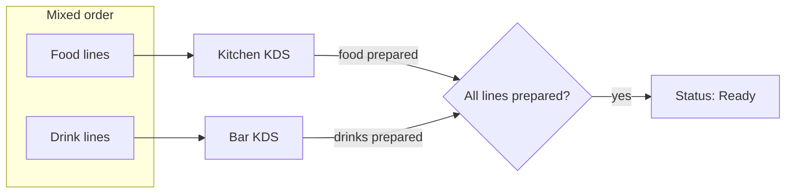
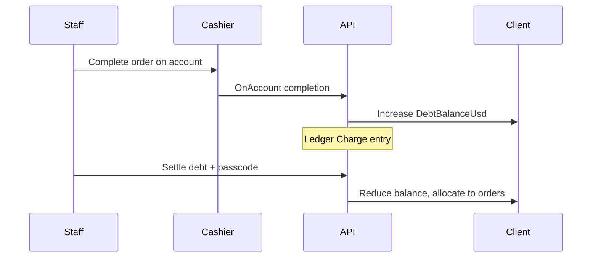
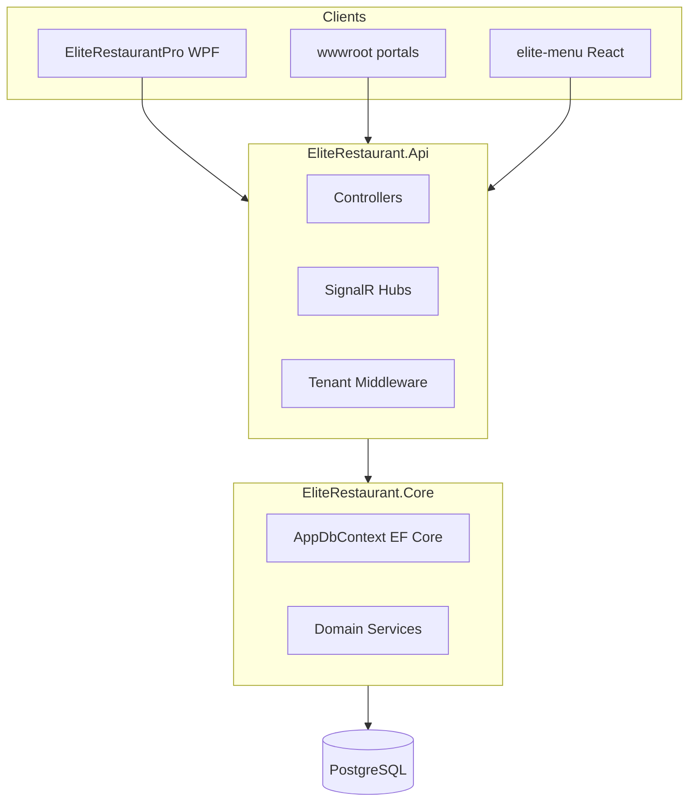

# EliteRestaurant — Complete Operations & Technical Guide

This document describes how EliteRestaurant works in production: staff workflows, business rules, and the codebase that implements them. It is derived from the repository at `c:\Users\ernes\Documents\EliteRestaurant` and reflects **actual** behavior in code—not aspirational features.

**Related docs:** [Local development](LOCAL-DEVELOPMENT.md) · [Customer menu](CUSTOMER-MENU.md) · [PostgreSQL deployment](postgresql-cloud-deployment.md) · [Database setup](DATABASE-SETUP.md)

---

## Quick start — new restaurant setup

1. **PostgreSQL** — Create database `elite_restaurant` (see [DATABASE-SETUP.md](DATABASE-SETUP.md)).
2. **API** — From `EliteRestaurant.Api`, run `.\run-dev.ps1` (or deploy to cloud). On first boot, EF migrations apply automatically when a connection string is configured.
3. **Setup status** — `GET /api/setup/status`. If `setupRequired: true`, no tenant exists yet.
4. **First site** — Use **EliteRestaurantPro** → first-time setup wizard with **Cloud API URL** pointing at your API (e.g. `http://localhost:8080`). This calls `POST /api/setup/first-site` and creates the primary restaurant, admin user, and seed data.
5. **Desktop cloud URL** — Settings → Cloud API URL (stored in `%LocalAppData%\EliteRestaurantPro\settings\app-settings.json`).
6. **Appearance → Push to cloud** — Tax %, service %, timezone, branding, order-cancel passcode, client debt cap, and menu taxonomy sync to `PublicMenuSettings` in PostgreSQL.
7. **Staff tablets** — Open web portals (`/server/`, `/cashier/`, `/kitchen/`, `/bar/`, `/reception/`, `/admin/`) or use Elite Pro for admin/kitchen/desktop flows. Sign in with employee **Sign-in ID + PIN** via `POST /api/auth/login`.
8. **Guest menu** — Build `elite-menu` (`npm run build` → `EliteRestaurant.Api/wwwroot/menu/`). QR codes: Elite Pro → Settings → Menu QR Codes; base URL in Business Profile.
9. **Development tenant** — On `localhost`, the API uses the first restaurant when no custom domain matches (`TenantResolutionMiddleware` + dev fallback).

---

## Role cheat sheet

| Role | Primary surfaces | Typical responsibilities |
|------|------------------|---------------------------|
| **Admin** | EliteRestaurantPro, `/admin/` | Full configuration, orders override, reports, employees, appearance push, clients |
| **Manager** | EliteRestaurantPro, `/admin/` (write) | Same operational power as Admin for day-to-day management |
| **AdminWeb** | `/admin/` (read-only API policy) | Dashboard/report viewing without destructive writes |
| **Server** | `/server/`, Elite Pro create order | Table service, drafts, open checks (Food/Drink/Mixed), pickup, mark Served |
| **Cashier** | `/cashier/`, Elite Pro | Release tickets to kitchen, payments, online approval queue, reservations desk overlap |
| **Chef / Sous Chef** | `/kitchen/` | KDS: Waiting → In Kitchen → Ready (food lines; mixed tickets shared with bar) |
| **Barman / Bartender** | `/bar/` | KDS for drink lines on mixed or drink-only tickets |
| **Front desk** | `/reception/` (alias `/front-desk/`) | Reservations, online pickup/delivery tracking |
| **Guest** | `/menu/` (elite-menu) | Browse, draft or submit orders (no staff login) |

**Portal login** resolves PIN + role to a portal (`Server`, `Cashier`, `KitchenBar`, `Admin`, etc.). Logic: `EliteRestaurant.Core/Staff/StaffPortalAuthentication.cs`.

**JWT policies** (API): `AdminOnly`, `AdminWrite`, `OperationalWrite`, `ServerOnly`, `CashierOnly`, `KitchenOnly`, `BarOnly`, `StaffAny`, `ReceptionDesk`, `CashierDesk` — see `EliteRestaurant.Api/Program.cs`.

---

# Part 1 — User training & operations

## 1.1 System overview

EliteRestaurant is a multi-tenant restaurant platform:

- **Cloud API** (`EliteRestaurant.Api`) — ASP.NET Core, PostgreSQL, SignalR, static staff portals, built guest menu.
- **Desktop admin** (`EliteRestaurantPro`) — WPF app for configuration, reporting, create-order, kitchen (desktop), clients, appearance.
- **Guest menu** (`elite-menu`) — React/Vite app; production build lives under `wwwroot/menu/`.
- **Shared logic** (`EliteRestaurant.Core`) — EF models, order workflow, pricing, clients/debt, reservations.
- **Contracts** (`EliteRestaurant.Contracts`) — DTOs shared between API and Pro.

Data is scoped per **restaurant** (`RestaurantId` on tenant-scoped entities). Guests and staff hit the same API host; the tenant is resolved from the request domain (or dev headers).

---

## 1.2 Order statuses and lifecycle

Canonical workflow constants live in `EliteRestaurant.Core/Utils/OrderWorkflow.cs`.

| Status | Meaning |
|--------|---------|
| **Pending cashier** | In-store ticket submitted; awaits cashier release to kitchen |
| **Pending approval** | Guest/table or online order submitted; awaits cashier (or manager) release |
| **Waiting** | Released to kitchen queue (incoming column on KDS) |
| **In Kitchen** | Preparation in progress |
| **Ready** | All prep stations finished; ready for server pickup or guest fulfillment |
| **Served** | In-store: server delivered food/drinks to table; cashier may take payment |
| **Completed** | Paid or closed on client account |
| **Cancelled** | Voided (requires **order cancel passcode** when configured) |
| **Debt** (display only) | UI label when order is on account and not fully settled (`OrderDisplayStatus`) |

### In-store dine-in flow



### Online / QR table submit flow

Table QR orders use `POST /api/public/menu/orders/submit` → status **Pending approval** (`OrderOrigin.Online`). Cashier releases to **Waiting** (same as pending cashier release). Payment timing may be **deferred** for online checkout; cashier completes when **Ready** (or Served) per `OrderWorkflow.CanCashierComplete`.

### Guest draft flow (no immediate order)

`POST /api/public/menu/draft` creates a `SharedOrderDraft` (customer icon prefix `🧑` in server UI). Server converts draft to a real check from `/server/` or Elite Pro.

---

## 1.3 Open checks: Food, Drink, Mixed

Each table may have **one open check** at a time (`OrderWorkflow.IsOpenCheckStatus`). When adding items, staff choose or infer check type:

| Check kind | Allowed cart |
|------------|----------------|
| **Food** | Food products only |
| **Drink** | Drink products only |
| **Mixed** | Both food and drinks on one ticket |

Rules: `EliteRestaurant.Core/Orders/OpenCheckKindHelper.cs`. Server portal validates on submit (`EliteRestaurant.Api/Controllers/ServerPortalController.cs`).

**Guest QR / table submit** uses a **mixed cart** in `elite-menu` (`elite-menu/src/hooks/useCart.js`)—food and drinks together without separate check tabs.

---

## 1.4 Kitchen and bar (mixed tickets)

Prep visibility is split by **menu taxonomy** (drink vs food), not only legacy category strings:

- **Kitchen portal** (`/kitchen/`) — Shows orders with at least one food line; line filter hides drinks.
- **Bar portal** (`/bar/`) — Shows orders with at least one drink line; line filter hides food.
- **Legacy KitchenBar** — Combined queue (desktop kitchen view).

For a **mixed** ticket, kitchen marks food lines prepared; bar marks drink lines. Order moves to **Ready** only when **every line** on the ticket is prepared (`AdminOrderOperationsService.TryMarkPrepStationReady`).



---

## 1.5 Server pickup — partial then full serve

Servers see pickup tickets when food or drinks are ready but not yet served (`ServerOrderStationStatus.Compute`):

- **Serve drinks** / **Serve food** — `POST /api/server/orders/{id}/serve-station` with body `{ "station": "Bar" }` or `"Kitchen"`. Sets `OrderItem.ServerServedAt` for that station’s lines only.
- **Mark served** (full ticket) — `POST /api/server/orders/{id}/serve` — Requires all lines prepared; sets status **Served**.

Partial pickup is allowed while status is **In Kitchen** or **Ready** if that station’s lines are prepared (`ServerPortalController.ServeStation`).

Summary strings (e.g. “Drinks ready · Food cooking”) come from `ServerOrderStationStatus.BuildPrepSummary`.

---

## 1.6 Cashier operations

**Release to kitchen** — Moves **Pending cashier** (in-store) or **Pending approval** (online) → **Waiting**, deducts inventory (`OrderInventoryDeduction`). Available via cashier UI or SignalR `OrderHub.StartPreparation`.

**Complete payment** — In-store: only from **Served**. Online: from **Ready** or **Served** (`OrderWorkflow.CanCashierComplete`). Records amounts, change, currency, posts ledger when payment confirmed.

**Client account** — At completion, cashier may put ticket **on account** (see §1.8) instead of immediate payment.

---

## 1.7 Guest menu (`/menu/`)

| Capability | Endpoint / behavior |
|------------|---------------------|
| Config (tax, service, branding) | `GET /api/public/menu/config` — uses `PricingResolver.ResolveEffectiveRestaurantPricing` |
| Browse products | Public menu product APIs |
| Table QR | `?table={id}` — submit requires assigned server on table |
| Draft | `POST /api/public/menu/draft` — notifies server group (`CustomerDraftArrived`) |
| Table order submit | `POST /api/public/menu/orders/submit` → **Pending approval** |
| Online pickup/delivery | `POST /api/public/menu/orders/online` — mixed cart, fulfillment mode, guest payment intent |
| Call server | `POST /api/public/menu/call-server` — SignalR `ServerTableCall` |

Guests **cannot** apply staff discounts, cancel with passcode, or send directly to kitchen without cashier release.

**Languages:** English/French via `GET /api/language/strings?lang=` and `localStorage` key `elite_lang` (see `elite-menu/README.md`).

---

## 1.8 Client accounts and debt

**Clients** (`RestaurantClient`) — Managed in Elite Pro **Clients** view and `GET/POST /api/clients`. Regular clients have unique phone (non-staff). **Staff clients** mirror employees for staff-meal discounts.

**On account** — When completing an order, staff link a client and choose settlement **OnAccount** (`ClientSettlement.OnAccount`). Order status becomes **Completed** with `AmountOnAccountUsd`; client `DebtBalanceUsd` increases. Ledger: `ClientDebtLedgerEntry` type Charge.

**Debt cap** — Default $250; override via Appearance / `PublicMenuSettings.ClientDebtCapUsd` (`ClientDebtSettingsHelper`).

**Settlement** — Apply payment against oldest open on-account orders (`ClientAccountService.TrySettleDebt`). Requires the same **order cancel passcode** validation as cancellations (`OrderCancelPasscodeHelper`).

**Display status** — Orders with open on-account balance show as **Debt** in lists (`OrderDisplayStatus`).



---

## 1.9 Reservations and front desk

- **Reservation floor** — SignalR hub `/hubs/reservation-floor`; Elite Pro `ReservationFloorWebView`, API `FloorReservationController`, `ReservationsController`.
- **Reception portal** (`/reception/`) — Online delivery/pickup tracking; joins SignalR group `Reception`.
- **Public reservations** — Settings on `PublicMenuSettings` (lead days, max months ahead); guest flows in public menu API.

Automated processors (non-test): no-show, reminders, lifecycle (`Program.cs` hosted services).

---

## 1.10 Settings managers care about

### Appearance (Elite Pro → Appearance)

Pushed to cloud `PublicMenuSettings` (key `default`):

| Setting | Purpose |
|---------|---------|
| Tax % / Service % | Guest totals and tickets; merged via `PricingResolver` |
| Rounding rules | Line, subtotal, grand total |
| Restaurant timezone (IANA) | Reports, client dates, display (`RestaurantTimeZone`, default `Africa/Kinshasa`) |
| Order cancel passcode | Cancellations + debt settlement |
| Client debt cap | Maximum open debt per client |
| Menu taxonomy JSON | Drink vs food classification for KDS/split |
| Branding, online promo, ticket footer | Guest menu and receipts |

File: `EliteRestaurantPro/Views/AppearanceSettingsView.xaml`, `AppearanceSettingsViewModel.cs`.

### Business profile

Public menu base URL, QR generation, phone, address, order cancel passcode (local file fallback).

### Currency

USD + FC dual display; exchange rate on `PublicMenuSettings` / `CurrencyPricing`.

---

## 1.11 Pricing and totals (operations view)

1. **Line subtotal** — Sum of product price × quantity.
2. **Discount** — None, Percent, or fixed USD off subtotal.
3. **Tax & service** — Percents from cloud menu settings if set, else desktop `app-settings.json` (`PricingResolver.ResolveRestaurantTaxPercent` / `ResolveRestaurantServicePercent`).
4. **Delivery fee** — Online delivery orders (stored separately for reporting).
5. **Grand total** — `OrderTotalsHelper` with rounding modes.

**Deployment note:** API `appsettings` `CurrencyPricing:TaxPercent` / `ServicePercent` apply to **server/cashier host** overrides; guest menu uses cloud profile + file merge, not deployment appsettings alone (`PricingResolver` XML docs).

---

## 1.12 Order cancel passcode

Configured in Appearance → pushed to `PublicMenuSettings.OrderCancelPasscode`. Validated for:

- Cancelling open orders (web shared script `wwwroot/shared/order-cancel-passcode.js`, Elite Pro `OrderCancelPasscodeDialog`)
- Client debt settlement

If unset, operations return: *“Order cancel passcode is not configured…”*

---

## 1.13 Real-time alerts (staff)

SignalR **Order hub** (`/hubs/order`): staff join groups `Server`, `Cashier`, `Kitchen`, `Reception`. Events include `OrderStageChanged`, `CustomerDraftArrived`, kitchen queue updates.

Connect with JWT (`access_token` query on hub URL). Shared UI helper: `wwwroot/shared/order-stage-alert.js`.

---

## 1.14 Web portals reference

| URL path | Audience |
|----------|----------|
| `/menu/` | Guests |
| `/server/` | Servers (cashier may access some endpoints) |
| `/cashier/` | Cashiers |
| `/kitchen/` | Kitchen |
| `/bar/` | Bar |
| `/reception/`, `/front-desk/` | Front desk |
| `/admin/` | Admin web dashboard |
| `/` | Marketing/landing SPA (`wwwroot/index.html`) |

Staff portals are **single-page HTML/JS** under `EliteRestaurant.Api/wwwroot/`. Localization: strings from `wwwroot/locales/` via language API.

---

## 1.15 EliteRestaurantPro (desktop) highlights

| Area | View / module |
|------|----------------|
| Dashboard & KPIs | `AdminDashboardView` |
| Orders & detail | `AdminOrdersView`, `OrderDetailPanelView` |
| Create order / tables | `CreateOrderView`, `TablesView` |
| Kitchen (desktop KDS) | `KitchenOrdersView` |
| Server pickup | `ServerPickupView` |
| Menu & inventory | `MenuView`, `InventoryView` |
| Employees & attendance | `EmployeesView`, `AttendanceView` |
| Money & reports | `MoneyView`, `ReportsView` |
| Clients | `ClientsView` |
| Appearance & cloud push | `AppearanceSettingsView` |
| First setup | `FirstSiteSetupView` |

Cloud operations use API clients in `EliteRestaurantPro/ApiClients/`.

---

## 1.16 Daily operations checklist

**Opening**

- Verify API health (`/api/health`).
- Kitchen/bar tablets signed in and joined hub groups.
- Cashier releases any overnight **Pending approval** online orders.

**Service**

- Assign servers to tables.
- Use correct open-check type (Food/Drink/Mixed).
- Monitor SignalR alerts for new guest drafts and stage changes.

**Closing**

- Clear **Served** tickets at cashier.
- Settle client debt or note open **Debt** display orders.
- Review reservation floor for no-shows.

---

# Part 2 — Technical reference

## 2.1 Solution architecture



| Project | Role |
|---------|------|
| `EliteRestaurant.Api` | HTTP API, hubs, static files, tenancy middleware |
| `EliteRestaurant.Core` | Entities, migrations, business logic |
| `EliteRestaurant.Contracts` | Shared DTOs (admin, auth, clients, public menu, setup) |
| `EliteRestaurantPro` | WPF desktop |
| `EliteRestaurant.Tests` / `EliteRestaurant.Core.Tests` | Unit/integration tests |
| `elite-menu` | Guest SPA source |
| `SeedRunner` | Seeding utility |

---

## 2.2 Configuration and startup

**Entry:** `EliteRestaurant.Api/Program.cs`

- **Database:** `AppDbContext` + Npgsql; connection from `DefaultConnection`, `ELITE_POSTGRES_CONNECTION`, or `DATABASE_URL` (`AppDbContext.TryGetPostgreSqlConnectionString`).
- **Migrations:** Applied on startup via `DatabaseInitializer` (non-testing).
- **JWT:** `JwtOptions` / `JwtTokenService`; hub token from query `access_token`.
- **Serilog:** Console + rolling file `logs/elite-api-*.log`.
- **Rate limits:** Public menu read/draft, setup endpoints.
- **CORS:** Permissive policy for SPA/dev.

**Testing environment:** In-memory DB, no tenant middleware, no reservation hosted services.

---

## 2.3 Multi-tenancy

| Component | Path |
|-----------|------|
| Tenant context | `EliteRestaurant.Core/Tenancy/ITenantContext` |
| Resolution | `EliteRestaurant.Api/Tenancy/RestaurantTenantResolver` |
| Middleware | `EliteRestaurant.Api/Middleware/TenantResolutionMiddleware` |
| JWT alignment | `TenantJwtAlignmentMiddleware` |
| Bootstrap / backfill | `EliteRestaurant.Core/Data/RestaurantTenantBootstrap.cs` |
| Scoped entities | `IRestaurantScoped` (orders, products, clients, …) |

Production: resolve restaurant by **Host** (custom domain). Development: fallback to first restaurant; optional headers `X-Restaurant-Id` / `X-Restaurant-Slug`.

Setup endpoints (`/api/setup/*`) skip tenant middleware.

---

## 2.4 Data model essentials

**Order** — `EliteRestaurant.Core/Models/OrderRecord.cs`

- Links: table, server, client, reservation.
- Financial: `PaymentAmountUsd`, `PaymentCurrencyCode`, `ClientSettlement`, `AmountOnAccountUsd`, `ClientDebtSettledUsd`.
- Origin: `OrderOrigin` (InStore vs Online), `OrderSource` (WalkIn, Pickup, Delivery, …).
- Workflow: `Status`, `CustomerFulfillmentStatus`, `ConfirmationCode` (guest online).

**Order line** — `OrderItem`: `KitchenPreparedAt`, `ServerServedAt`, prep assignee fields.

**Client** — `RestaurantClient`, `ClientDebtLedgerEntry`, `ClientDebtLedgerEntryType`.

**Settings** — `PublicMenuSetting` (per-restaurant cloud row), local `SettingsManager` / `app-settings.json` under `%LocalAppData%\EliteRestaurantPro\settings\`.

**DbContext** — `EliteRestaurant.Core/Data/AppDbContext.cs` (global query filters per tenant).

---

## 2.5 API surface (controllers)

| Controller | Route prefix | Notes |
|------------|--------------|-------|
| `AuthController` | `/api/auth` | Login, session |
| `SetupController` | `/api/setup` | First site, status, wipe (secret) |
| `PublicMenuController` | `/api/public/menu` | Anonymous guest APIs |
| `ServerPortalController` | `/api/server` | Open checks, drafts, serve-station |
| `CashierPortalController` | `/api/cashier` | Queue, payment, release |
| `KitchenPortalController` | `/api/kitchen` | KDS advance |
| `BarPortalController` | `/api/bar` | Bar KDS |
| `ReceptionController` | `/api/reception` | Front desk |
| `ClientsController` | `/api/clients` | CRUD, debt, settle |
| `AdminOrdersController` | `/api/admin/orders` | Admin order ops |
| `AdminPortalController` | `/api/admin/portal` | Dashboard slices |
| `AdminSettingsController` | `/api/admin/settings` | Cloud settings sync |
| `AdminSyncController` | `/api/admin/sync` | Outbox sync |
| `OrdersStaffController` / `StaffOrdersController` | Staff order helpers |
| `ReservationsController`, `FloorReservationController`, `PublicFloorReservationController` | Reservations |
| `LanguageController` | `/api/language` | i18n strings |
| `HealthController` | `/api/health` | Liveness |

Swagger: `/swagger` in Development.

---

## 2.6 Order domain services

| Type | Location | Responsibility |
|------|----------|----------------|
| `OrderWorkflow` | `Core/Utils/OrderWorkflow.cs` | Status constants, KDS visibility, open check, cashier complete rules |
| `AdminOrderOperationsService` | `Core/Orders/AdminOrderOperationsService.cs` | Release, cancel, advance, mark ready (per station) |
| `OpenCheckKindHelper` | `Core/Orders/OpenCheckKindHelper.cs` | Food/Drink/Mixed validation |
| `KitchenQueueKindFilter` | `Core/Orders/KitchenQueueKindFilter.cs` | Portal queue filtering |
| `ServerOrderStationStatus` | `Core/Orders/ServerOrderStationStatus.cs` | Partial serve state machine |
| `OrderSubmissionHelper` | `Core/Orders/OrderSubmissionHelper.cs` | Line assignee, payment sync |
| `OrderDisplayStatus` | `Core/Orders/OrderDisplayStatus.cs` | Debt overlay for UI |
| `OrderCancelPasscodeHelper` | `Core/Orders/OrderCancelPasscodeHelper.cs` | Passcode from DB or file |
| `ClientAccountService` | `Core/Clients/ClientAccountService.cs` | Clients, on-account, settlement |
| `PricingResolver` | `Core/Utils/PricingResolver.cs` | Tax/service merge |
| `RestaurantTimeZone` | `Core/Utils/RestaurantTimeZone.cs` | IANA conversion |
| `FinancialTransactionService` | `Core/Data/FinancialTransactionService.cs` | Ledger on payment |

---

## 2.7 SignalR

| Hub | Path | Groups / methods |
|-----|------|------------------|
| `OrderHub` | `/hubs/order` | `JoinServer`, `JoinCashierDashboard`, `JoinKitchen`, `JoinReception`; `StartPreparation`, `MarkOrderReadyForCashier`, … |
| `ReservationFloorHub` | `/hubs/reservation-floor` | Floor plan realtime |

Broadcast helpers: `EliteRestaurant.Api/Hubs/OrderHubBroadcasts.cs` — `BroadcastOrderStageAsync`, `OrderStageChangedDto`, audience routing by stage.

---

## 2.8 Guest menu build pipeline

| Step | Command / output |
|------|------------------|
| Dev | `elite-menu/run-dev.ps1` → Vite `:5173/menu/`, proxy `/api` → API |
| Build | `npm run build` in `elite-menu` |
| Output | `EliteRestaurant.Api/wwwroot/menu/` (`vite.config.js`: `base: '/menu/'`) |
| Config hook | `useCart.js` — mixed food+drink cart |

---

## 2.9 EliteRestaurantPro integration

- Settings: `SettingsManager`, `app-settings.json` (DPAPI on Windows).
- Cloud push: `AdminSettingsApiClient`, appearance view model maps timezone, passcode, pricing.
- Order cloud ops: `AdminOrderCloudOperations`, `CreateOrderViewModel`.
- API base: `EliteApiClient` / `cloudApi.baseUrl`.

---

## 2.10 EF Core migrations

Migrations live in `EliteRestaurant.Core/Migrations/`. Apply:

```powershell
dotnet ef database update --project EliteRestaurant.Core --startup-project EliteRestaurant.Api
```

Recent feature migrations (examples):

| Migration | Feature |
|-----------|---------|
| `20260530084552_AddRestaurantClientsAndDebt` | Clients, ledger, on-account fields |
| `20260530120000_AddOrderCancelPasscodeToPublicMenuSettings` | Cancel passcode in cloud |
| `20260530160000_AddOrderItemServerServedAt` | Partial server serve timestamps |
| `20260601120000_AddRestaurantTimeZoneToPublicMenuSettings` | IANA timezone in cloud |

Snapshot: `AppDbContextModelSnapshot.cs`.

---

## 2.11 Security model

- **Staff:** JWT after PIN login; role claims enforce policies.
- **Admin web read-only:** `AdminWebReadOnlyApiMiddleware` blocks mutating verbs for `AdminWeb` role.
- **Guest:** `[AllowAnonymous]` on `PublicMenuController`; rate limited.
- **Setup wipe:** `X-Setup-Secret` header (`SetupController`).
- **HTML portals:** CSP on non-API routes; `no-store` cache on `.html`.

Dev bypass: `AuthDevOptions` (see `AdminDevLoginBypass`).

---

## 2.12 Inventory and financial integrity

- **Release / place order:** `OrderInventoryDeduction.TryApplyForPlacedOrder` inside release transaction.
- **Cancel:** Does not automatically restock in all paths—verify `AdminOrderOperationsService` and inventory tests before assuming.
- **Payment confirmation:** `PaymentConfirmedAt` gates revenue posting for deferred payments.
- **Mixed currency:** `MoneyReportingHelpers.MixedCurrency` for USD+FC payments.

---

## 2.13 Localization

- Canonical JSON: `EliteRestaurant.Api/wwwroot/locales/`
- API: `LanguageController`
- Portals: fetch strings by language; preference stored client-side.
- Workspace rule: static portals and elite-menu support EN/FR.

---

## 2.14 Testing

| Suite | Focus |
|-------|-------|
| `EliteRestaurant.Tests` | Workflow, open checks, kitchen filter, pricing, timezone, server station, public online orders |
| `EliteRestaurant.Core.Tests` | Core-specific |
| API integration | `PublicOnlineOrderTests`, in-memory or test host |

Run: `dotnet test` from solution root.

---

## 2.15 Key file index (developers)

| Topic | Path |
|-------|------|
| API startup | `EliteRestaurant.Api/Program.cs` |
| Order workflow | `EliteRestaurant.Core/Utils/OrderWorkflow.cs` |
| Mixed / open checks | `EliteRestaurant.Core/Orders/OpenCheckKindHelper.cs` |
| KDS filtering | `EliteRestaurant.Core/Orders/KitchenQueueKindFilter.cs` |
| Server partial serve | `EliteRestaurant.Core/Orders/ServerOrderStationStatus.cs` |
| Server API | `EliteRestaurant.Api/Controllers/ServerPortalController.cs` |
| Public guest API | `EliteRestaurant.Api/Controllers/PublicMenuController.cs` |
| Pricing merge | `EliteRestaurant.Core/Utils/PricingResolver.cs` |
| Timezone | `EliteRestaurant.Core/Utils/RestaurantTimeZone.cs` |
| Clients / debt | `EliteRestaurant.Core/Clients/ClientAccountService.cs` |
| Tenant middleware | `EliteRestaurant.Api/Middleware/TenantResolutionMiddleware.cs` |
| SignalR broadcasts | `EliteRestaurant.Api/Hubs/OrderHubBroadcasts.cs` |
| Guest cart | `elite-menu/src/hooks/useCart.js` |
| Appearance UI | `EliteRestaurantPro/Views/AppearanceSettingsView.xaml` |
| Staff auth | `EliteRestaurant.Core/Staff/StaffPortalAuthentication.cs` |

---

## 2.16 Deployment notes

- **DigitalOcean / cloud:** See `docs/CLOUD-DEPLOYMENT-DIGITALOCEAN.md`, `postgresql-cloud-deployment.md`.
- **Env vars:** `DATABASE_URL`, `JWT__SigningKey`, `PORT` (default 8080).
- **Static assets:** Deploy API including `wwwroot` (portals + `menu/` build).
- **Local vs prod DB:** Separate PostgreSQL instances; pushing code runs migrations on target DB only—data does not sync automatically ([LOCAL-DEVELOPMENT.md](LOCAL-DEVELOPMENT.md)).

---

## Document maintenance

When adding features, update this guide only after verifying behavior in code and tests. Prefer linking to **file paths** above rather than line numbers, which drift quickly.

*Generated for EliteRestaurant repository — operations and technical reference in one volume.*
