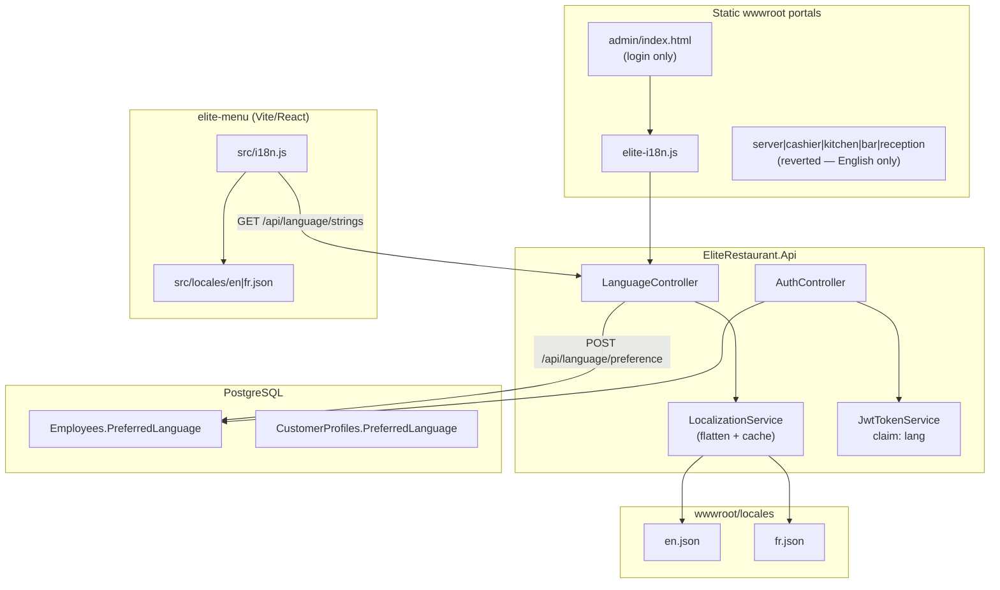

# EliteRestaurant Localization — Technical Implementation Report

**Document version:** 1.0  
**Date:** 2026-05-20  
**Scope:** EN/FR language feature as implemented in `EliteRestaurant` (post-revert state)  
**Audience:** Engineers maintaining API, static portals, and `elite-menu`

---

## 1. Summary

The localization initiative introduced a **shared string catalog** (JSON on disk), a **server-side loader/API**, **persistence of user language preference** on `Employee` and `CustomerProfile`, and **two client integration patterns**:

| Layer | Pattern | Status after revert |
|-------|---------|---------------------|
| API | `LocalizationService` + `LanguageController` | **Active** |
| DB | `PreferredLanguage` columns + migration | **Active** |
| Auth | `preferredLanguage` on login + JWT `lang` claim | **Active** |
| React (`elite-menu`) | `i18next` + bundled locales + remote merge | **Active (partial UI coverage)** |
| Static HTML (`wwwroot`) | `elite-i18n.js` + `data-i18n` | **Active (admin login only)** |
| Static portals (server, cashier, kitchen, bar, reception) | `elite-portal-i18n.js` + selector maps + JS `t()` | **Reverted** |

**User-validated success:** Staff hub (`/staff` in `elite-menu`) — language toggle and hub card copy switch EN/FR.  
**User-reported failure (reverted):** Server portal (and by extension the shallow portal wiring) — toggling FR changed only a handful of labels; nav labels showed **concatenated** EN+FR text (e.g. `Incoming OrderCommande entrante`).

---

## 2. Design goals (original intent)

1. **Single source of truth** for UI strings served to web clients from the API host.
2. **English default**, French optional, normalized to `en` | `fr` only.
3. **Client-side persistence** via `localStorage` key `elite_lang` (shared across static pages and React).
4. **Staff preference** stored in DB and reflected in JWT for future server-side use.
5. **No WPF (EliteRestaurantPro) translation** in this phase (explicitly deferred).

---

## 3. Architecture



### 3.1 Key normalization rule

All entry points use the same rule: any code starting with `fr` (case-insensitive) → `fr`; otherwise → `en`.

| Location | Implementation |
|----------|----------------|
| `LocalizationService.NormalizeLanguage` | C# `StartsWith("fr")` |
| `elite-i18n.js` | `indexOf('fr') === 0` |
| `elite-menu/src/i18n.js` | `startsWith('fr')` |

There is **no** `en-US` / `fr-CA` split; no RTL; no plural/gender rules.

### 3.2 Storage key (browser)

```text
localStorage["elite_lang"] ∈ { "en", "fr" }
```

React and static scripts read/write the **same key**, so switching language on the staff hub affects the value admin login reads on next load (same origin).

---

## 4. Backend — detailed specification

### 4.1 Configuration

**File:** `EliteRestaurant.Api/appsettings.json`

```json
"Localization": {
  "DefaultLanguage": "en",
  "SupportedLanguages": [ "en", "fr" ],
  "EnableCaching": true,
  "CacheDurationMinutes": 60
}
```

**Type:** `LocalizationOptions` (`EliteRestaurant.Api/Services/LocalizationOptions.cs`)  
**Registration:** `Program.cs`

```csharp
builder.Services.Configure<LocalizationOptions>(builder.Configuration.GetSection("Localization"));
builder.Services.AddSingleton<LocalizationService>();
```

### 4.2 `LocalizationService`

**File:** `EliteRestaurant.Api/Services/LocalizationService.cs`

| Method | Behavior |
|--------|----------|
| `NormalizeLanguage(string?)` | `fr*` → `fr`, else `en` |
| `GetString(key, language?)` | Dot-path lookup in nested JSON (e.g. `auth.signInId`) |
| `GetAllStrings(language?)` | **Flattens** entire JSON tree to `Dictionary<string, object?>` with keys like `staff.hubTitle` |
| `LoadDocument` | Reads `{ContentRoot}/wwwroot/locales/{lang}.json`; falls back to default language file if missing |

**Caching:** `ConcurrentDictionary<string, CacheEntry>` holding parsed `JsonDocument` with TTL `CacheDurationMinutes`.  
**Implication:** Editing locale JSON on a running server may serve stale strings until cache expiry unless caching is disabled or process restarted.

**Flattening algorithm:** Recursive walk of `JsonElement`; object keys joined with `.`; arrays stored as raw JSON string; primitives as CLR values. Used by API clients that expect a flat map (static `elite-i18n.js` unflatten on the client).

### 4.3 `LanguageController`

**Route prefix:** `/api/language`

| Endpoint | Auth | Purpose |
|----------|------|---------|
| `GET /api/language/strings?lang=` | Anonymous | Returns `{ language, strings }` where `strings` is flat |
| `GET /api/language/supported` | Anonymous | Default + supported list |
| `POST /api/language/preference?lang=` | `StaffAny` policy | Updates `Employee.PreferredLanguage` for JWT `employeeId` |

**Language resolution** (`ResolveLanguage`) when `lang` query is omitted:

1. `Accept-Language` header (first tag only, before `;`)
2. Else `LocalizationOptions.DefaultLanguage`

**Not implemented:** Reading `lang` from JWT on `GET strings` (anonymous endpoint has no user context).

### 4.4 Database migration

**Migration:** `20260521120000_AddPreferredLanguage`  
**Columns:**

| Table | Column | Type | Default |
|-------|--------|------|---------|
| `Employees` | `PreferredLanguage` | `text` NOT NULL | `'en'` |
| `CustomerProfiles` | `PreferredLanguage` | `text` NOT NULL | `'en'` |

**Model properties:** `Employee.PreferredLanguage`, `CustomerProfile.PreferredLanguage` (`EliteRestaurant.Core/Models`).

**Customer profile language:** Column exists; **no consumer-facing API** was wired in this phase to set it from the public menu.

### 4.5 Authentication integration

**DTO:** `CloudLoginRequest` (`EliteRestaurant.Contracts/Auth/AuthDtos.cs`)

```csharp
public sealed record CloudLoginRequest(
    string StaffId,
    string Pin,
    string Portal,
    string? PreferredLanguage = null);
```

**Login merge logic** (`AuthController.Login`):

```csharp
var employeeLang = db.Employees.AsNoTracking()
    .Where(e => e.Id == outcome.Session.EmployeeId)
    .Select(e => e.PreferredLanguage)
    .FirstOrDefault();

var jwt = jwtTokenService.CreateToken(
    outcome.Session,
    out var expiresAtUtc,
    string.IsNullOrWhiteSpace(request.PreferredLanguage)
        ? employeeLang
        : request.PreferredLanguage);
```

**Priority:** Request body `preferredLanguage` wins when non-empty; otherwise DB value; JWT always gets normalized `lang` claim.

**JWT claim:** `lang` (`JwtTokenService.CreateToken`) — available for future middleware/localized error messages; **not consumed** by portals after revert (portals do not read JWT for UI).

**Admin web** sends preference on login:

```javascript
await api("/api/auth/login", "POST", {
  staffId, pin, portal: "AdminWeb",
  preferredLanguage: EliteI18n.lang
}, false);
```

**Reverted portals** had begun sending `preferredLanguage` on login; that wiring was removed with `git checkout` on portal files.

---

## 5. Locale catalog (`wwwroot/locales`)

**Active files:**

- `EliteRestaurant.Api/wwwroot/locales/en.json`
- `EliteRestaurant.Api/wwwroot/locales/fr.json`

**Top-level namespaces (current, post-revert):**

| Namespace | Purpose |
|-----------|---------|
| `common.*` | Buttons, cloud status, generic actions |
| `menu.*` | Public menu terminology (also used in reports labels) |
| `staff.*` | **Staff hub** card titles/descriptions |
| `auth.*` | Login strings + admin read-only copy |
| `reservation.*` | Reservation flow (for future React screens) |
| `orders.*` | Order status labels |
| `reports.*` | Admin report tab names |
| `errors.*` / `validation.*` | Generic errors |

**Removed in revert:** Entire `portals.*` subtree (~150+ keys per language) covering server/cashier/kitchen/bar/reception UI. Those keys existed only during the reverted implementation.

**Duplicate catalogs:** `elite-menu/src/locales/en.json` and `fr.json` are **separate copies** (not generated from `wwwroot/locales`). They can drift unless synchronized manually or by build step (no sync tooling was added).

---

## 6. React client (`elite-menu`)

### 6.1 Stack

- `i18next` + `react-i18next` (`package.json` dependencies added in this feature)
- Entry: `import './i18n.js'` in `main.jsx`

### 6.2 Initialization (`src/i18n.js`)

1. **Synchronous init** with bundled `en` / `fr` nested JSON (`resources.translation`).
2. **Initial language:** `getSavedLanguage()` from `localStorage`.
3. **Async enhancement:** `loadRemoteTranslations(saved)` fetches flat strings from API, `unflatten`s, `i18n.addResourceBundle(code, 'translation', nested, true, true)` (deep merge, overwrite).
4. **`setAppLanguage(lang)`:** persist → remote load → `i18n.changeLanguage`.

**Fallback:** `fallbackLng: 'en'`; missing keys show key path or English bundle.

### 6.3 `LanguageSwitcher` component

- Toggles `en` ↔ `fr` via `setAppLanguage`.
- Displays `FR` or `EN` label (not full language names).
- Uses `t('common.switchLanguage')` for `title` / `aria-label`.

### 6.4 Screens with `useTranslation()` (actual coverage)

| File | Translated content |
|------|------------------|
| `App.jsx` | Staff hub (`HubHome`), cloud status strings, portal redirect message |
| `HeroScreen.jsx` | Hero CTAs / labels (partial hero) |
| `LoadingScreen.jsx` | Loading copy |
| `ErrorScreen.jsx` | Error copy |
| `LanguageSwitcher.jsx` | Switcher chrome |

**Not wired (still hardcoded English):**  
`MenuScreen`, `CartScreen`, `ConfirmScreen`, `ReservationScreen`, `ProductSheet`, `OnlineOrder*`, `CategoryBar`, `PriceBreakdown`, etc. (~29 other JSX modules).

**Assessment:** Staff hub localization **works** because those keys live under `staff.*` and `common.*` in JSON and are referenced in `App.jsx`. Deep menu/checkout flows were **out of scope** of the first implementation pass.

---

## 7. Static client (`elite-i18n.js`)

**File:** `EliteRestaurant.Api/wwwroot/js/elite-i18n.js`  
**Pattern:** IIFE attaching `window.EliteI18n`.

| API | Behavior |
|-----|----------|
| `load(lang?)` | `fetch('/api/language/strings?lang=')` → `flat` + `nested` |
| `t(key, fallback)` | Dot-path on `nested` |
| `setLanguage` / `toggleLanguage` | Persist, reload, set `document.documentElement.lang`, dispatch `elite-language-changed` |
| `mountSwitcher(container)` | Injects button `EN \| FR` / `FR \| EN` |
| `applyToDocument(root?)` | All `[data-i18n]` → `textContent` or `placeholder` (INPUT/TEXTAREA) |

**Limitations by design:**

- No React/Vue integration; no automatic hook into `innerHTML` templates.
- No `{{variable}}` interpolation in the **kept** version (interpolation was added only in the reverted server pass).
- `data-i18n` on `<option>` elements works via `textContent` (supported in admin discount modes only if present).

### 7.1 Admin portal (only static consumer)

**File:** `wwwroot/admin/index.html`

**Translated:** Login screen only (`auth.*`, `common.signIn`).  
**Not translated:** Entire post-login dashboard (reports, charts, tables, modals) — thousands of lines of inline English.

**Init block:**

```javascript
await EliteI18n.load();
EliteI18n.mountSwitcher($("adminLoginLangMount"));
EliteI18n.applyToDocument(document);
window.addEventListener("elite-language-changed", () => EliteI18n.applyToDocument(document));
```

---

## 8. Reverted implementation (technical post-mortem)

Two phases were implemented and then **rolled back** (portal HTML/JS restored from `HEAD`; `elite-portal-i18n.js` / CSS deleted; `portals.*` removed from API locale files).

### 8.1 Phase A — “All webapps” wiring

**Intent:** Apply same pattern as admin to `server`, `cashier`, `kitchen`, `bar`, `reception`, `cashier-order.html`.

**Changes made:**

| Artifact | Description |
|----------|-------------|
| `elite-portal-i18n.js` | Portal detector via `body[data-portal]` or URL path; `PORTAL_MAPS` with CSS selector → key arrays |
| `elite-portal-i18n.css` | `.elite-lang-switch`, `.portal-lang-mount` |
| Per-portal HTML | `<body data-portal="...">`, `#portalLangMount`, script tags after inline JS |
| `cashier-app.js` / `reception-app.js` | `preferredLanguage` on login; a few empty-state strings via `EliteI18n.t` |
| `locales/*.json` | Added `portals.shared`, `portals.server`, `portals.cashier`, etc. |

**`PORTAL_MAPS` mechanism:**

```javascript
// Simplified
static: [ [selector, i18nKey, fallback?], ... ]  // querySelectorAll + setText
nav:    [ [selector, i18nKey, fallback?], ... ]  // setNavLabel on single button
applyPortal(name) → applyStatic + applyNav + EliteI18n.applyToDocument()
```

**Init:**

```javascript
await EliteI18n.load();
mountSwitcher on #portalLangMount and #portalLangMountSidebar;
applyPortal(portal);
window.addEventListener('elite-language-changed', () => applyPortal(portal));
```

**Coverage reality (server example):**

| UI surface | Lines / mechanism | Mapped? |
|------------|-------------------|---------|
| Login + sidebar nav | HTML | Partially (~10 selectors) |
| Take Order POS | 1500+ lines HTML + 2000+ lines inline JS | **~15 selectors** |
| Dynamic cart/products/open checks | `innerHTML` / `textContent` in JS | **Almost none** |
| Menu product names | API `products[].name` | **N/A** (data, not i18n) |
| Category tabs | Built from API categories in JS | **Not mapped** (until phase B) |

**Result:** User sees FR toggle but **~95% of strings remain English** — consistent with reported behavior.

### 8.2 Phase B — Server portal “deep fix”

**Intent:** Fix concatenation bug; add `t()` helper; `data-i18n` on static HTML; translate JS-generated strings; `refreshServerI18nUi()` on language change.

#### 8.2.1 Nav label bug (confirmed root cause of doubled text)

**HTML structure:**

```html
<button class="nav-btn" data-tab="incomingOrderTab">
  Incoming Order
  <span id="incomingNavBadge" class="nav-incoming-badge"></span>
</button>
```

**Broken `setNavLabel` behavior:**

1. Original text node `"Incoming Order"` remains.
2. Code inserts `<span data-i18n-label>Commande entrante</span>` before badge.
3. DOM displays: `Incoming Order` + `Commande entrante` → user-visible glue: **`Incoming OrderCommande entrante`**.

**Fix attempted:** Strip text nodes before updating label; move nav text into `<span data-i18n="...">` in HTML and remove `applyNav` for server.

#### 8.2.2 `EliteI18n.t(key, fallback, vars)` interpolation

Added `{{n}}`, `{{code}}` replacement for dynamic hints (tax %, open check messages). Only lived in reverted server inline script.

#### 8.2.3 `refreshServerI18nUi()`

On `elite-language-changed`, called:

- `ElitePortalI18n.applyPortal('server')`
- `renderCategoryTabs`, `renderProducts`, `renderCart`, `renderTotals`, `updateTicketModeHint`, `renderOpenChecks`, `renderIncomingDrafts`, `renderReadyOrders`, `renderMenuCatalog`, `renderTables`

**Problem:** Many other code paths set English strings without going through these functions (alerts, `setOut`, SignalR handlers, draft flows). Full coverage would require **auditing every `textContent` / `innerHTML` / `alert`** in ~3400-line file.

#### 8.2.4 Category / table status translation

`translateCategoryLabel()` mapped known English category names to keys (`All` → `portals.server.catAll`). **Fragile:** Any new category from DB not in map stays English. **Amuse-Bouche** etc. are proper names and were not in map.

#### 8.2.5 Data vs UI

| Content | Source | Localized? |
|---------|--------|------------|
| Product name | `products` API | No |
| Product category | API | Only via fixed map |
| Table name | API | No |
| Order status (`Waiting`, `Served`) | API enums | Displayed raw in hints |
| Tax/service **labels** | Config % in JS | Yes (phase B) |
| Tax amounts | Computed | Format only (`$`) |

---

## 9. What worked (evidence-based)

| Item | Why it worked |
|------|----------------|
| `GET /api/language/strings?lang=fr` | Stateless, flat JSON, no auth; easy to test in browser |
| Staff hub EN/FR | Small, React-isolated surface; keys in `staff.*`; `LanguageSwitcher` on `HubHome` |
| Admin login EN/FR | Finite DOM; `data-i18n` + `applyToDocument`; login errors use `EliteI18n.t` |
| `localStorage` + shared key | Same origin across `/staff`, `/admin`, `/server` |
| DB `PreferredLanguage` + login body | Straightforward EF migration; merge logic in `AuthController` |
| JWT `lang` claim | Token issued correctly; backward-compatible optional param |
| Remote merge in `elite-menu` | `addResourceBundle(..., true, true)` overlays API keys onto bundle without rebuild |

---

## 10. What did not work (and why)

| Symptom | Root cause | Category |
|---------|------------|----------|
| Server nav `Incoming OrderCommande entrante` | Text node + injected span (`setNavLabel`) | **Bug** |
| Server FR: 2–3 labels only | Selector map covered &lt;5% of UI; rest in JS templates | **Incomplete integration** |
| Open checks / cart / search still English | `innerHTML` built with string literals; no `t()` | **Architecture mismatch** |
| Category chips mixed EN/FR | Partial `translateCategoryLabel`; DB names not bilingual | **Data + partial map** |
| Product names always English | Menu catalog is API data, not locale JSON | **By design / different feature** |
| Cashier/kitchen/bar/reception “nothing changed” | Thin wiring (login labels only); no JS render hooks | **Incomplete integration** |
| Admin after login still English | Never attempted dashboard `data-i18n` | **Scope gap** |
| Cart/checkout on public menu English | React screens not using `useTranslation` | **Scope gap** |
| `POST /api/language/preference` unused by UI | No caller wired in frontends | **Dead API surface** |
| Locale drift React vs API | Two JSON trees manually maintained | **Operational risk** |
| Cache staleness on hot-edit JSON | `LocalizationService` in-memory cache | **DevEx footgun** |

### 10.1 Architectural mismatch (core lesson)

Static portals are **monolithic single-file applications**:

- `server/index.html` ≈ **3,450 lines** (HTML + CSS + inline JS).
- Rendering is **imperative** (`el.innerHTML = \`...\``), not declarative.

The `data-i18n` + one-shot `applyToDocument` pattern fits **stable DOM** (login forms). It does **not** fit **dynamic POS UI** without:

1. Extracting all user-visible strings to a dictionary,
2. Replacing every template literal with `t('key')`,
3. Subscribing all render functions to `elite-language-changed`,
4. Optionally splitting JS into modules and adding tests.

Phase A tried to avoid (1–3) via CSS selector maps — insufficient.

### 10.2 Why React hub succeeded where server failed

| Factor | Staff hub (`elite-menu`) | Server portal |
|--------|--------------------------|---------------|
| UI framework | React + `useTranslation` | Vanilla JS |
| String locations | Centralized `t()` calls (few files) | Scattered literals in 1 huge file |
| Re-render | React re-renders on `changeLanguage` | Manual re-call of render helpers |
| State | Component tree | Global mutable DOM |

---

## 11. Revert procedure (what was undone)

Executed operationally (not a git revert commit):

```bash
git checkout HEAD -- \
  EliteRestaurant.Api/wwwroot/server/index.html \
  EliteRestaurant.Api/wwwroot/cashier/index.html \
  EliteRestaurant.Api/wwwroot/cashier/cashier-app.js \
  EliteRestaurant.Api/wwwroot/kitchen/index.html \
  EliteRestaurant.Api/wwwroot/bar/index.html \
  EliteRestaurant.Api/wwwroot/reception/index.html \
  EliteRestaurant.Api/wwwroot/reception/reception-app.js \
  EliteRestaurant.Api/wwwroot/cashier-order.html
```

**Deleted:**

- `wwwroot/js/elite-portal-i18n.js`
- `wwwroot/css/elite-portal-i18n.css`

**Trimmed:** `portals.*` from `wwwroot/locales/en.json` and `fr.json`

**Restored:** `elite-i18n.js` to simpler API (no `setNavLabel`, no `setText`, no `{{var}}` interpolation)

---

## 12. Current file inventory

### 12.1 Active (localization-related)

```
EliteRestaurant.Api/
  Services/LocalizationService.cs
  Services/LocalizationOptions.cs
  Controllers/LanguageController.cs
  wwwroot/locales/en.json
  wwwroot/locales/fr.json
  wwwroot/js/elite-i18n.js
  wwwroot/admin/index.html          # partial data-i18n
EliteRestaurant.Core/
  Migrations/20260521120000_AddPreferredLanguage.cs
  Models/Employee.cs                # PreferredLanguage
  Models/CustomerProfile.cs         # PreferredLanguage
EliteRestaurant.Contracts/Auth/AuthDtos.cs
EliteRestaurant.Api/Security/JwtTokenService.cs
EliteRestaurant.Api/Controllers/AuthController.cs
elite-menu/
  src/i18n.js
  src/locales/en.json
  src/locales/fr.json
  src/components/LanguageSwitcher.jsx
  package.json                      # i18next, react-i18next
```

### 12.2 Removed / reverted

```
EliteRestaurant.Api/wwwroot/js/elite-portal-i18n.js      # deleted
EliteRestaurant.Api/wwwroot/css/elite-portal-i18n.css  # deleted
locales/*/portals.*                                     # removed from JSON
Portal HTML: data-portal, script includes, preferredLanguage on login
Server: t(), refreshServerI18nUi, translateCategoryLabel, 80+ data-i18n attrs
```

---

## 13. API contract reference

### 13.1 `GET /api/language/strings?lang=fr`

**Response shape:**

```json
{
  "language": "fr",
  "strings": {
    "common.signIn": "Connexion",
    "staff.hubTitle": "Choisissez votre espace",
    "staff.server": "Serveur"
  }
}
```

ASP.NET Core JSON camelCases property names (`LanguageStringsResponse` record).

### 13.2 `POST /api/language/preference?lang=fr`

**Auth:** Bearer staff JWT  
**Effect:** `Employees.PreferredLanguage = 'fr'`  
**UI usage:** None wired in current codebase.

### 13.3 Login with preference

**Request:**

```json
{
  "staffId": "SRV01",
  "pin": "3101",
  "portal": "Server",
  "preferredLanguage": "fr"
}
```

**Effect:** JWT includes `"lang": "fr"`; DB updated only via explicit preference endpoint or if login merge writes through extended logic (login sets JWT from request; DB column updated only when `POST preference` is called — **login does not persist `PreferredLanguage` to DB unless separate code path exists**).

**Important nuance:** `AuthController` uses `request.PreferredLanguage` for JWT but does **not** call `employee.PreferredLanguage = ...; SaveChanges` on login. Persistence on login would require an additional EF update (not present in reviewed `AuthController` snippet). Only `POST /api/language/preference` updates DB.

---

## 14. Deferred / not implemented

| Item | Notes |
|------|-------|
| WPF EliteRestaurantPro `.resx` | Explicitly out of scope |
| Localized API error messages | `LocalizationService.GetStringOrDefault` exists server-side; controllers still return English |
| Bilingual menu entities | Product/category names from DB |
| Admin dashboard i18n | Login only |
| `elite-menu` cart, reservation, checkout | No `useTranslation` |
| Customer `PreferredLanguage` | Column only |
| Build-time sync `wwwroot/locales` → `elite-menu/src/locales` | Manual duplication |
| RTL / additional languages | Normalization hard-codes `en`/`fr` |
| E2E tests for language toggle | None added |

---

## 15. Recommendations for a future portal i18n pass

1. **Do not use selector maps** for large inline-JS portals; use **module extraction + `t()` everywhere** or migrate portal to React/Vue.
2. **Fix nav pattern upfront:** wrap label in `<span data-i18n>`; never leave bare text nodes next to badge spans.
3. **Single render bus:** `function renderAll() { ... }` called on load, lang change, and data refresh.
4. **Separate UI strings from API data;** document which fields need `NameFr` in DB vs JSON catalog.
5. **Persist language on login** if desired: update `Employee.PreferredLanguage` in `AuthController` when `request.PreferredLanguage` is set.
6. **Add `dotnet tool` or script** to sync locale JSON between API and Vite bundle.
7. **Integration tests:** `GET strings?lang=fr` contains `staff.hubTitle`; optional Playwright for hub toggle.

---

## 16. Verification checklist (current state)

| Test | Expected |
|------|----------|
| `curl http://localhost:8080/api/language/strings?lang=fr` | 200, French `staff.hubTitle` |
| Open `/staff` (built `elite-menu`) | Toggle FR; hub cards French |
| Open `/admin/` login | Toggle FR; login form French |
| Open `/server/` | **English only** (reverted) |
| JWT decode after admin login with FR selected | Claim `lang` = `fr` |
| DB `Employees.PreferredLanguage` after `POST preference` | Updated |
| DB after login only | Unchanged unless preference endpoint called |

---

*End of report.*
